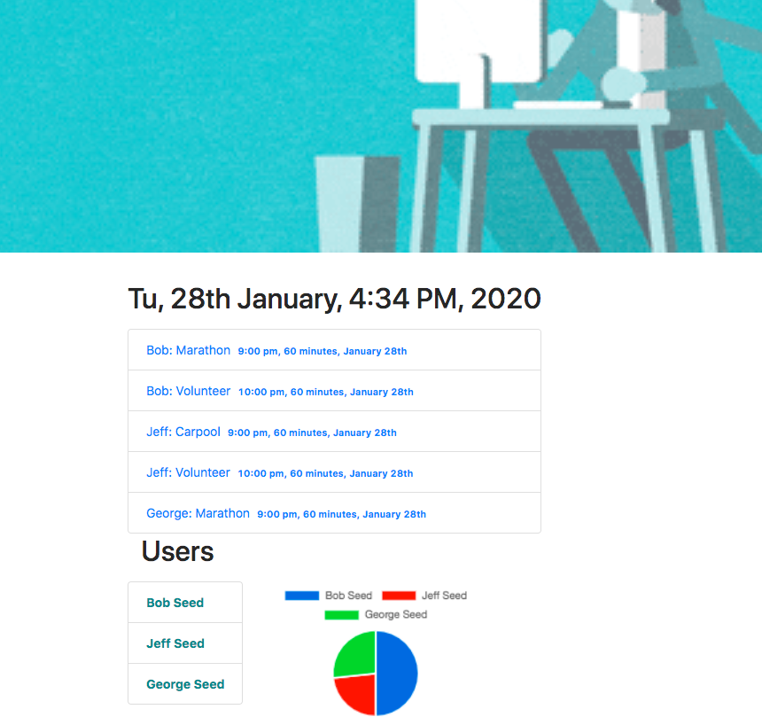
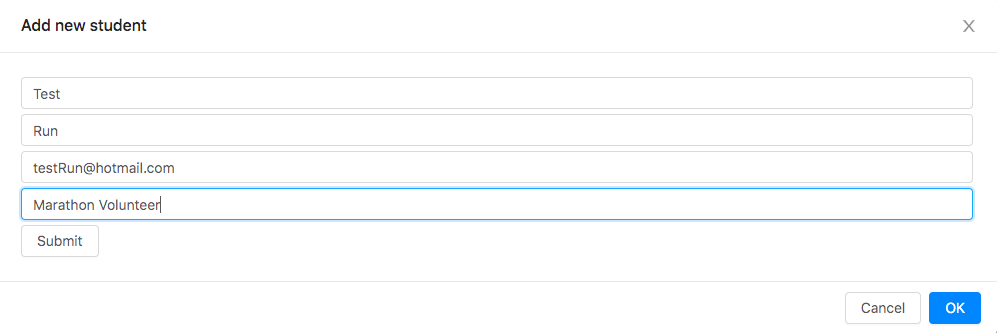
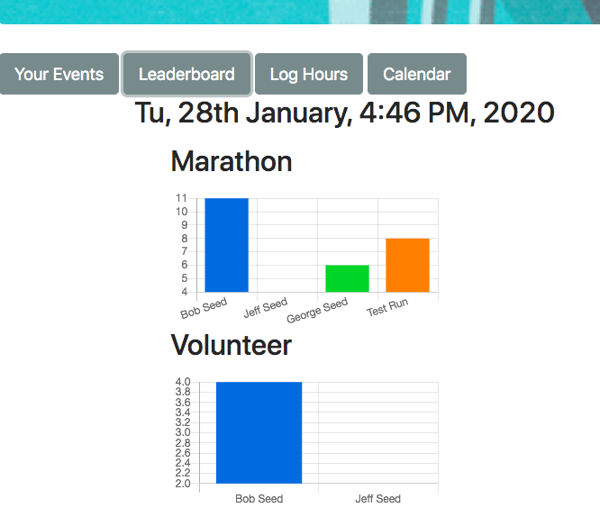
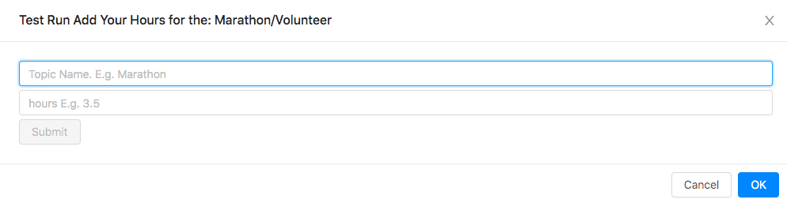

# Back Track

 

## Description

Back Track is group activity tracker which uses the MERN Stack (MongoDB, Express, React, Node.js) to encourage participation in shared activities. Back Track allows busy people to schedule and share events by streamlining the tradiational calendar interface. Back Track also displays leaderboards to reward users who schedule the most hours in a particular topic.

 

## Run Instructions

The user begins at the home page:

If there are events scheduled for the day they are displayed below the date. There is also an index of users with links to their individual page on the home page. Next to the users a pie chart with the total hours each member has plotted. There is a nav bar at the top of the home page which contains a button to make a new user. When the button is clicked the user is taken to the students database page. There is a footer at the bottom of the page contains a button to make a new user. This will bring up the form below.

When the information is filled out the user will appear on the students database page and the home page as well. They can click their name on the home page to go to their individual page shown below.

Here they can see bar graphs of all of the topics they are signed up for with all hours put in by each member. They can also see their personal events, add hours to their respective topics and see the group calendar.

## This App Utilizes

- [Mongo DB/Mongoose](https://www.npmjs.com/package/mongoose)

- [Express](https://www.npmjs.com/package/express)

- [ReactJS](https://reactjs.org/)

- [Node JS](https://nodejs.org/en/)

- [Google Calendar API](https://developers.google.com/calendar/)

- [formik](https://www.npmjs.com/package/formik)

- [Ant Design](https://ant.design/)

- [Bootstrap](https://getbootstrap.com/)

 

## Role in Development

My name is Alex I am a bootcamp student whose portfolio can be found
[here](https://alexsamalot19.github.io/Samalot-Alexander-Portfolio/).

I developed this app to collect data from the Google calendar API, store user information in the database and design an intuitive and stylish front end. The site is deployed to Heroku [here](https://back-track.herokuapp.com/).
